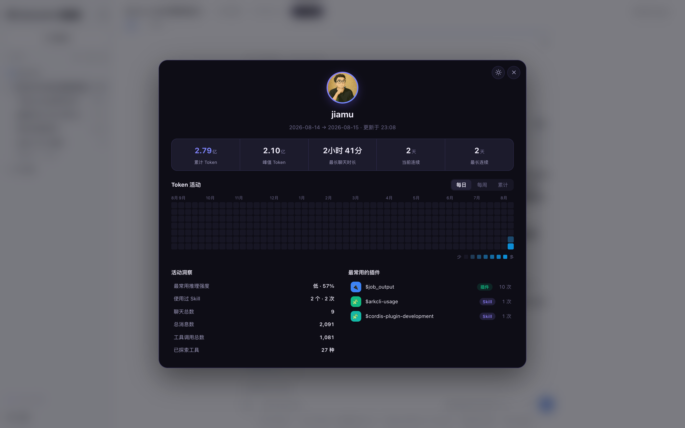
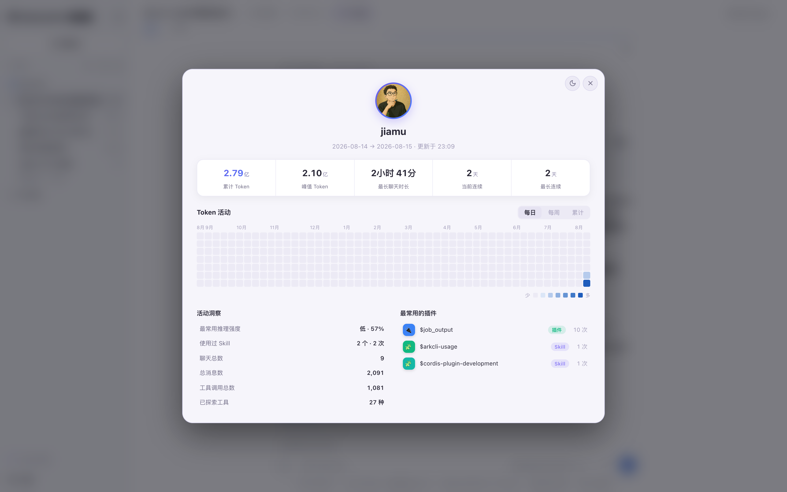
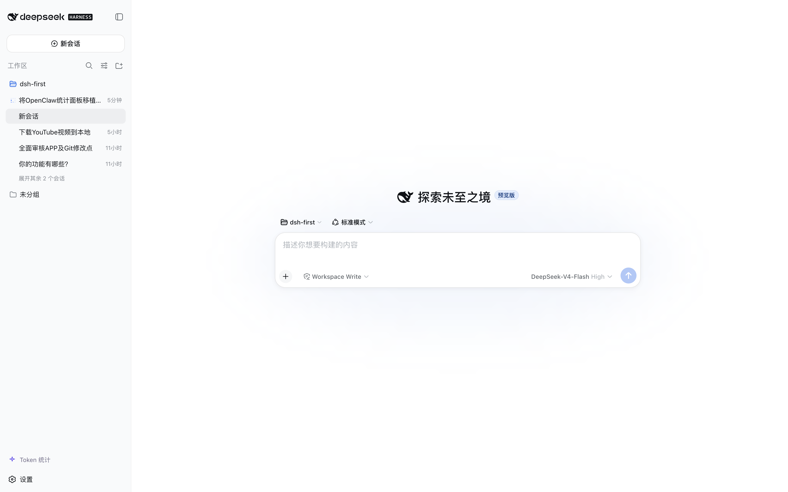

# dsh-token-usage

**English** · [中文](./README.md)

**Token usage stats panel for DSH** — Codex usage-page style. See your whole DeepSeek Harness instance's token consumption at a glance: totals / per-session peaks, activity heatmap, top plugins.


## What is this?

DSH just launched, and the first thing everyone wants to know is: **where did my tokens go?**

This plugin adds a token-usage stats panel to the DSH web UI, aggregating token consumption across **all sessions** of the running instance. Click any entry point to open the centered panel (dark / light theme):




## Features

- **5 headline metrics**: total / per-session peak tokens, longest chat duration, current / longest streak
- **Token activity heatmap**: daily (GitHub contribution graph) / weekly (bars) / cumulative (line) views with hover tooltips
- **Activity insights (incl. top model) + top 5 plugins / skills**: see who is burning the most at a glance
- **Two native entry points**, blended into the DSH UI:
  - "Token 统计" button at the bottom of the sidebar (always available)
  - Live usage capsule in the session header: `⚡ 2.61亿` (auto-refreshes every 5s)
- **Deep-space purple dual theme**, follows the system / manual toggle



## Why install it

- **See where tokens go**: totals, per-session peaks, and the daily heatmap — no more guessing
- **Zero learning curve for Codex users**: the familiar usage-page style, instantly readable
- **A natural thing to share**: everyone loves posting "look how many tokens I burned today" — one screenshot is the best marketing

## Installation

The plugin depends on DSH's built-in packages (`@deepseek-ai/*`); dropping it into the DSH repo resolves them automatically — nothing extra to install.

### Option 1: Let your Agent install it in one sentence (recommended)

Send this sentence to your DSH Agent — it will read this repo and complete the install:

> Take a look at this repo: https://github.com/jiamuAi/dsh-token-usage , then install dsh-token-usage on my DSH.

### Option 2: Manual install

```sh
git clone https://github.com/jiamuAi/dsh-token-usage.git
cp -R dsh-token-usage <your-deepseek-harness-path>/packages/extensions/
cd <your-deepseek-harness-path> && pnpm install && pnpm run build:lib
```

> `<your-deepseek-harness-path>` = where the DSH source lives on your machine. Don't know it? Run `readlink -f $(which dsh)` in a terminal to see dsh's real path; the `deepseek-harness` directory is right above it.

Then edit `~/.dsh/profiles/web/package.json` and add to `dsh.profile.bundles`:

```json
"dsh-token-usage"
```

Finally restart `dsh web` and refresh the page.

## Usage

1. After restart, the **"Token 统计" entry appears at the bottom of the sidebar**
2. Open any session — the **live capsule `⚡ 2.61亿` shows next to the title**
3. Click either entry to open the panel; toggle theme / close from the top-right
4. The heatmap supports three views + hover tooltips for daily / weekly / cumulative values

Data refreshes every 5 seconds; history is backfilled automatically and survives restarts.

## Data accounting

Consistent with DSH's built-in token-meter:

- One usage record per step: `assistant/chunk {type:'usage'}` is the durable record; `assistant/message.usage` replaces the chunk record for the same step (no double counting)
- Total tokens = input + output + cacheRead + cacheWrite
- Thinking level is approximated from `reasoningTokens`; skill stats are parsed from `skill` tool call arguments

## Architecture

```
┌─ Host (inside the DSH process) ──────────────────┐
│ TokenUsageService (TypertRemoteService)          │
│  ├─ Backfills all historical sessions at boot    │
│  ├─ Folds session/event live                     │
│  └─ @Remote('getStats') → /api/tokenUsage/getStats
└──────────────┬───────────────────────────────────┘
               │ connection.rpc (generic channel, no DSH edits)
┌─ Browser ────▼───────────────────────────────────┐
│  ├─ sidebar.footer.action        sidebar entry   │
│  ├─ conversation.session.header.actions ⚡ capsule│
│  └─ shell.overlay                panel modal     │
└──────────────────────────────────────────────────┘
```

| File | Purpose |
|---|---|
| `src/index.ts` | Host half: aggregation logic + Typert Remote |
| `src/client/index.ts` | Browser half: panel UI + two entry points + 5s polling |
| `src/types.ts` | Cross-plane wire types |
| `cordis.patch.yml` | Bundle patch: inserts the plugin row |
| `lib/` | Committed build artifacts (runs as-is, no build needed) |

## Development

`lib/` ships prebuilt — **regular users don't need to build**. To change code, the build pipeline needs the DSH repo's toolchain (tsc + tsdown + Typert generator): put `src/` under the DSH repo's `packages/extensions/dsh-token-usage/`, build there, and sync the resulting `lib/` back to this repo.

## License

[MIT](./LICENSE)

---

Made for the DSH community · Star / Issue / PR welcome
