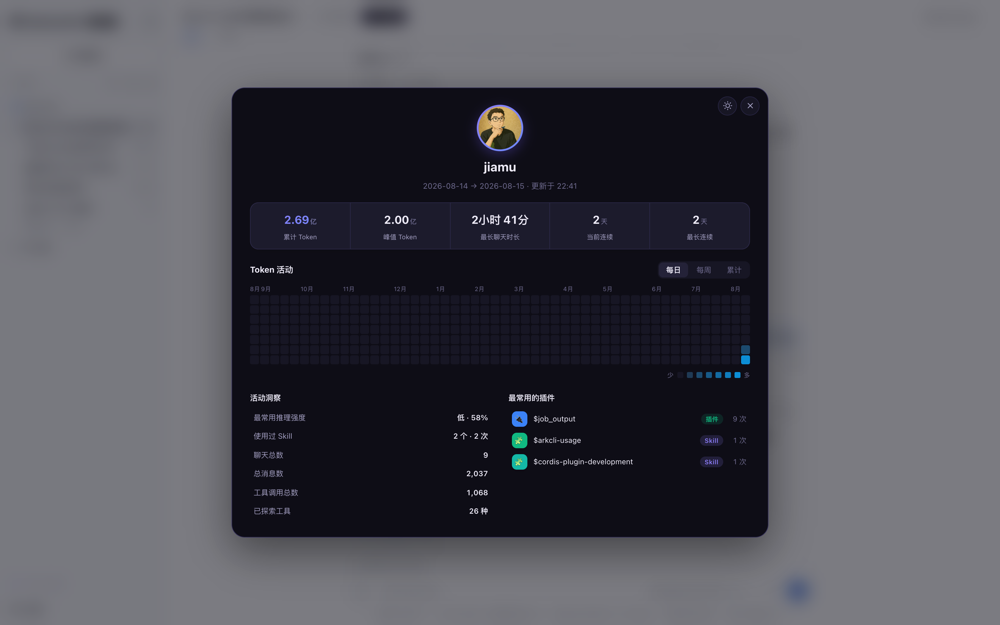
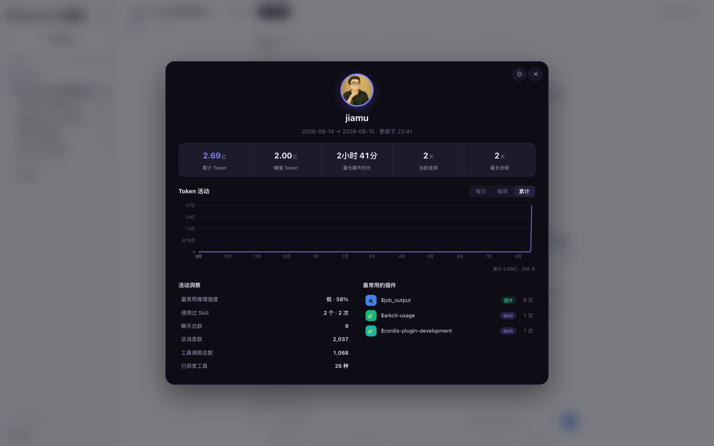

# dsh-token-usage

**DSH 的 Token 用量统计面板** —— 仿 Codex 个人用量页风格，把整个 DSH 实例的 Token 消耗一目了然地展示出来：累计 / 峰值、活动热力图、插件 Top5。


## 这是什么

DSH 刚发布，大家最关心的就是：**我的 Token 到底花哪去了？**

这个插件在 DSH Web 界面里加一个 Token 用量统计面板，把当前运行实例**全部会话**的 token 消耗汇总，点击入口即弹出居中面板：




## 特性

- **5 大指标**：累计 / 峰值 Token、最长聊天时长、当前 / 最长连续天数
- **Token 活动热力图**：每日（GitHub 贡献图）/ 每周（柱状）/ 累计（折线）三视图，悬浮看数值
- **活动洞察 + 插件 / Skill Top5**：谁在消耗最多，一目了然
- **两个原生入口**，与 DSH UI 融为一体：
  - 侧边栏底部「Token 统计」按钮（应用级常驻）
  - 会话头部实时用量胶囊：`⚡ 2.61亿`（每 5 秒自动刷新）
- **深空紫双主题**，跟随系统 / 手动切换


## 为什么值得装

- **一眼看清 Token 去向**：累计、峰值、每日热力图，不用再猜
- **Codex 用户零学习成本**：熟悉的用量页风格，界面一看就懂
- **DSH 生态首发插件**：现在装，就是社区第一批尝鲜的人

## 安装

插件依赖 DSH 内置包（`@deepseek-ai/*`），放进 DSH 仓库即可自动解析，无需额外安装。

### 方式一：让 Agent 一句话装好（推荐）

把下面这句话发给你的 DSH Agent，它自己会完成全部安装：

> 把 dsh-token-usage 装成 DSH 正式插件：git clone https://github.com/jiamuAi/dsh-token-usage 到 deepseek-harness 的 packages/extensions/ 下，然后运行 pnpm install 和 pnpm run build:lib，在 ~/.dsh/profiles/web/package.json 的 dsh.profile.bundles 里加上 dsh-token-usage，重启 dsh web。

### 方式二：手动装（3 步）

```sh
git clone https://github.com/jiamuAi/dsh-token-usage.git
cp -R dsh-token-usage /path/to/deepseek-harness/packages/extensions/
cd /path/to/deepseek-harness && pnpm install && pnpm run build:lib
```

然后编辑 `~/.dsh/profiles/web/package.json`，在 `dsh.profile.bundles` 里加上：

```json
"dsh-token-usage"
```

最后重启 `dsh web`，刷新页面即可看到入口。

## 使用

1. 重启后，**左侧栏底部**出现「Token 统计」入口
2. 打开任意会话，**标题旁**出现实时用量胶囊 `⚡ 2.61亿`
3. 点击任一入口打开面板；右上角可切主题、关闭
4. 热力图支持三视图切换 + 悬浮看单日 / 单周 / 累计数值

数据每 5 秒刷新；历史会话自动回填，重启不丢。

## 数据口径

与 DSH 内置 token-meter 一致：

- 每 step 一条 usage 记录：`assistant/chunk {type:'usage'}` 为持久记录；`assistant/message.usage` 覆盖同一步的 chunk 记录（不重复计数）
- 累计 Token = input + output + cacheRead + cacheWrite
- thinking 等级由 `reasoningTokens` 近似；Skill 统计从 `skill` 工具调用参数解析

## 架构

```
┌─ Host（DSH 进程内）──────────────────────────────┐
│ TokenStatsService (TypertRemoteService)          │
│  ├─ 启动时回填全部历史 session                    │
│  ├─ session/event 实时折叠                        │
│  └─ @Remote('getStats') → /api/tokenStats/getStats│
└──────────────┬───────────────────────────────────┘
               │ connection.rpc（通用通道，无需改 DSH）
┌─ Browser ────▼───────────────────────────────────┐
│  ├─ sidebar.footer.action        侧栏入口        │
│  ├─ conversation.session.header.actions ⚡ 胶囊   │
│  └─ shell.overlay                面板模态框       │
└──────────────────────────────────────────────────┘
```

| 文件 | 作用 |
|---|---|
| `src/index.ts` | Host 半边：聚合逻辑 + Typert Remote |
| `src/client/index.ts` | 浏览器半边：面板 UI + 两个入口 + 5s 轮询 |
| `src/types.ts` | 跨平面 wire 类型 |
| `cordis.patch.yml` | bundle patch：插入插件行 |
| `lib/` | 已提交的构建产物（装了就能跑，无需构建） |

## 开发

`lib/` 里是现成构建产物，**一般使用者无需构建**。要改代码的话，构建链路依赖 DSH 仓库的编译工具（tsc + tsdown + Typert 生成器），把 `src/` 放进 DSH 仓库的 `packages/extensions/` 下构建（参考仓库内 `dsh-token-stats` 包的 tsconfig 与构建命令），构建产物 `lib/` 同步回本仓库提交即可。

## License

[MIT](./LICENSE)

---

Made for the DSH community · 欢迎 Star / Issue / PR
