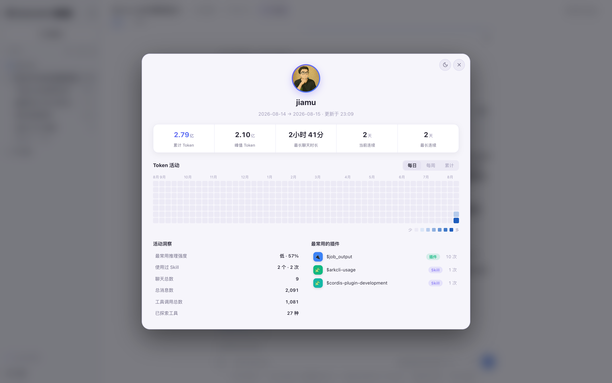
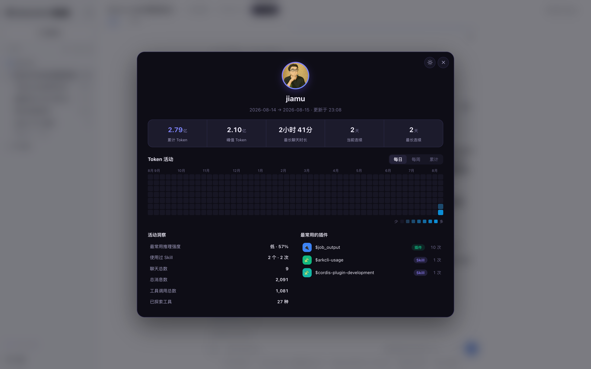
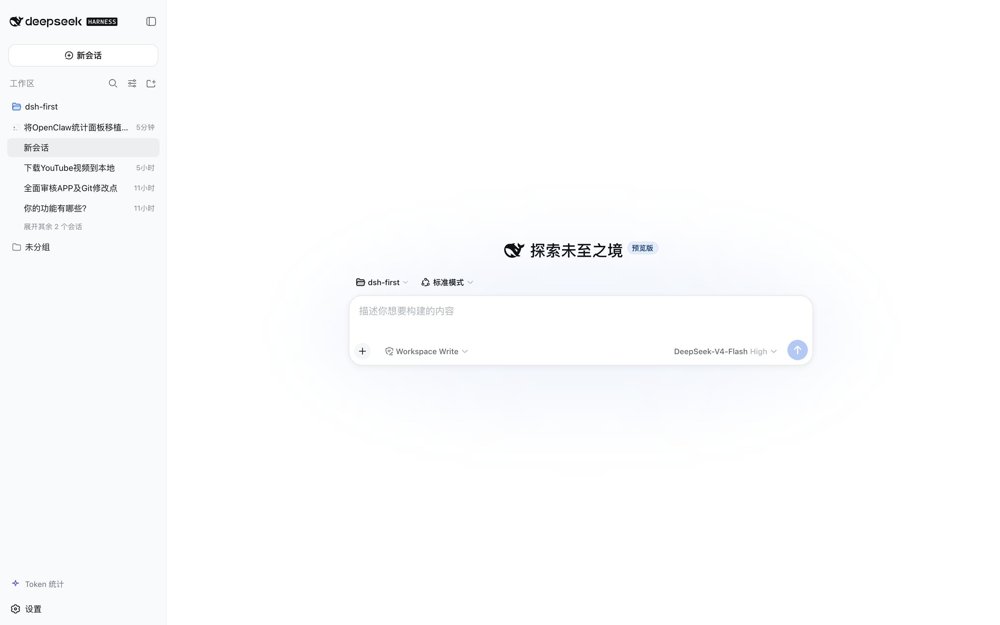

# dsh-token-usage

**中文** · [English](./README.en.md)

**DSH 的 Token 用量统计面板** —— 仿 Codex 个人用量页风格，把整个 DSH 实例的 Token 消耗一目了然地展示出来：累计 / 单会话峰值、活动热力图、插件 Top5。


## 这是什么

DSH 刚发布，大家最关心的就是：**我的 Token 到底花哪去了？**

这个插件在 DSH Web 界面里加一个 Token 用量统计面板，把当前运行实例**全部会话**的 token 消耗汇总，点击入口即弹出居中面板（深色 / 浅色主题）：




## 特性

- **5 大指标**：累计 / 单会话峰值 Token、最长聊天时长、当前 / 最长连续天数
- **Token 活动热力图**：每日（GitHub 贡献图）/ 每周（柱状）/ 累计（折线）三视图，悬浮看数值
- **活动洞察（含最常用模型）+ 插件 / Skill Top5**：谁在消耗最多，一目了然
- **两个原生入口**，与 DSH UI 融为一体：
  - 侧边栏底部「Token 统计」按钮（应用级常驻）
  - 会话头部实时用量胶囊：`⚡ 2.61亿`（每 5 秒自动刷新）
- **深空紫双主题**，跟随系统 / 手动切换



## 为什么值得装

- **一眼看清 Token 去向**：累计、单会话峰值、每日热力图，不用再猜
- **Codex 用户零学习成本**：熟悉的用量页风格，界面一看就懂
- **天然的传播素材**：大家都喜欢晒"我今天用了多少 token"，截一张图发出去，就是最好的宣传

## 安装

需要 DSH **0.2.1 及以上**。插件依赖 DSH 内置包（`@deepseek-ai/*`），运行时由 DSH 自己解析，无需额外构建。

### 方式一：直接从 GitHub 安装（推荐）

不用克隆仓库、本地也不用留一份源码，一条命令装好：

```sh
dsh plugin --profile web add github:gaodayihao/dsh-token-usage
```

不想开终端，也可以把这句话发给 DSH Agent，让它自己读仓库说明并装好：

> 你看一下这个仓库：https://github.com/gaodayihao/dsh-token-usage ，然后帮我把 dsh-token-usage 安装到我的 DSH 上。

或者在 Web 界面走 **插件 → 添加插件**，填入同样的规格
`github:gaodayihao/dsh-token-usage`（DSH 认 `github:` 简写；连不上 GitHub 时界面会提示改用国内镜像）。

**为什么这个仓库能直装**：仓库里已提交构建产物 `lib/`，并且**没有 `prepare` /
`postinstall` 脚本** —— pnpm 不会执行任何构建，也不会留下
`allowBuilds: { dsh-token-usage: set this to true or false }` 这种待审批条目
（带 `prepare` 的 Git 插件会被 pnpm 11 拦下，必须先去 profile 的
`pnpm-workspace.yaml` 里逐个放行）。装完即是可运行状态。

前提：本机有 `git`（pnpm 先用 `git ls-remote <repo> HEAD` 解析 ref，再下载该 commit 的
tarball），并且能访问 github.com —— 国内网络可走代理，或在 Web 界面按提示改用镜像源。

想锁死版本就带上 tag 或 commit：

```sh
dsh plugin --profile web add "github:gaodayihao/dsh-token-usage#v0.2.0"
```

不带 ref 时，pnpm 会把这次解析到的默认分支 commit 钉进 `pnpm-lock.yaml`，
已经在跑的实例不会因为仓库有新提交就被换掉；要挪到默认分支的最新 commit 用：

```sh
dsh plugin --profile web update dsh-token-usage
```

（`update` 会把 `github:` 规格重新解析到默认分支的新 commit；万一没动，就先
`dsh plugin --profile web remove dsh-token-usage`，再按上面的 `add` 装一次。）

`dsh plugin` 走的是 DSH 0.2.x 的原生 bundle 安装：把它写进 `~/.dsh/profiles/web/package.json`
的 `dependencies` 和 `dsh.profile.bundles`，并自动应用包内的 `cordis.patch.yml`，
把插件行插进加载树。装到别处就换 `--profile` 的名字（如 `tui`）。

最后重启 `dsh web`，刷新页面即可看到入口。

> **本仓库是 [`jiamuAi/dsh-token-usage`](https://github.com/jiamuAi/dsh-token-usage) 的 fork。**
> 上游 main 仍是 0.1.0（2026-08-15），在 DSH 0.2.1 上会因 TYPERT manifest /
> client bundle 写错包名而加载失败（见上游 issue #1）；本 fork 已含修复。
> 等修复合并回上游后，把上面的 `gaodayihao` 换成 `jiamuAi` 即可。

### 方式二：本地源码（改插件代码时用）

```sh
git clone https://github.com/gaodayihao/dsh-token-usage.git
dsh plugin --profile web add "file:$(pwd)/dsh-token-usage"
```

`file:` 装的是目录依赖，本地改完 `lib/` 重装即生效，适合开发调试；
对外分发请用上面的 `github:` 装法。

### ⚠️ 装本地源码时必须用 `file:`，不要用 `link:` 或裸路径

`dsh plugin --profile web add <绝对路径>`（不加 `file:` 前缀）会被 pnpm 记成
`link:`，而 **`link:` 不会安装该包的依赖**。本插件生成的 `lib/typert.host.js`
里有 `import { z } from 'zod'`，`link:` 之后插件目录不在 profile 的 `node_modules`
之下，zod 永远解析不到，于是：

```
typert-loader: dsh-token-usage exports "./typert" but importing ... failed:
  Cannot find package '.../node_modules/zod/index.js'
```

而 typert-loader 只要有一个 contributor 注册失败，**整轮注册都会中止** ——
后果不是插件单独失效，而是所有 Remote 端点都失去 strict 定义，DSH 界面会整体崩掉
（工作区列表空白、目录选择器报
`directoryPicker/pick: its strict definition was withdrawn and SRC fallback is forbidden`）。
数据不会丢，`~/.dsh/storages/workspace.json` 和会话日志都还在，移除该依赖重启即可恢复。

`file:` 与 `github:` 都**会**正常安装依赖（package 的 `node_modules` 里能看到 `zod`）；
只有 `link:` 例外。上面的 GitHub 直装因此没有这个坑。

要确认装对了，可以在装完后跑一次（把路径换成 profile 里的安装副本）：

```sh
node -e "import('file:///C:/Users/<你>/.dsh/profiles/web/node_modules/dsh-token-usage/lib/typert.host.js').then(m => console.log(m.TYPERT))"
```

打印出 `TYPERT` 对象就算通过；报 zod 找不到就是装成了 `link:`，卸掉重装。

### 从 0.1.x 升级

1. 若 `~/.dsh/profiles/web/package.json` 里已有一条旧的 `dsh-token-usage` 依赖，
   先 `dsh plugin --profile web remove dsh-token-usage`，再按上面重新安装
   （GitHub 直装，或本地源码加 `file:` 前缀）。
2. 若 profile 配置（`cordis.yml` / `cordis.patch.yml` / `--patch`）里有 `name` 为
   `@deepseek-ai/dsh-invariants` 或以 `/invariant` 结尾的行，请删掉 —— DSH
   v0.2.0-rc.2 起不再发布 `invariants` 服务与任何 `<包>/invariant` 子路径。
3. 重启 `dsh web` 并刷新页面。

> **0.1.x 的老装法已废弃**：以前是把源码拷进 `<deepseek-harness>/packages/extensions/`
> 再跑 `pnpm run build:lib`。DSH 更新会覆盖仓库目录，拷进去的文件随之丢失，插件于是"失效"。
> 请改用上面的 profile 安装方式，它写在 `~/.dsh/profiles/` 下，不受 DSH 更新影响。

## 使用

1. 重启后，**左侧栏底部**出现「Token 统计」入口
2. 打开任意会话，**标题旁**出现实时用量胶囊 `⚡ 2.61亿`
3. 点击任一入口打开面板；右上角可切主题、关闭
4. 热力图支持三视图切换 + 悬浮看单日 / 单周 / 累计数值

数据每 5 秒刷新；历史会话自动回填，重启不丢。

## 数据口径

与 DSH 内置 token-meter 一致：

- 每 step 一条 usage 记录：`assistant/chunk {type:'usage'}` 为持久记录；`assistant/message.usage` 覆盖同一步的 chunk 记录（不重复计数）
- 累计 Token = input + output + cacheRead + cacheWrite
- thinking 等级由 `reasoningTokens` 近似；Skill 统计从 `skill` 工具调用参数解析

## 架构

```
┌─ Host（DSH 进程内）──────────────────────────────┐
│ TokenUsageService (TypertRemoteService)          │
│  ├─ 启动时回填全部历史 session                    │
│  ├─ session/event 实时折叠                        │
│  └─ @Remote('getStats') → /api/tokenUsage/getStats│
└──────────────┬───────────────────────────────────┘
               │ connection.rpc（通用通道，无需改 DSH）
┌─ Browser ────▼───────────────────────────────────┐
│  ├─ sidebar.footer.action        侧栏入口        │
│  ├─ conversation.session.header.actions ⚡ 胶囊   │
│  └─ shell.overlay                面板模态框       │
└──────────────────────────────────────────────────┘
```

| 文件 | 作用 |
|---|---|
| `src/index.ts` | Host 半边：聚合逻辑 + Typert Remote |
| `src/client/index.ts` | 浏览器半边：面板 UI + 两个入口 + 5s 轮询 |
| `src/types.ts` | 跨平面 wire 类型 |
| `cordis.patch.yml` | bundle patch：插入插件行 |
| `lib/` | 已提交的构建产物（装了就能跑，无需构建） |

## 开发

`lib/` 里是现成构建产物，**一般使用者无需构建**。要改代码的话，构建链路依赖 DSH 仓库的编译工具（tsc + tsdown + Typert 生成器），把 `src/` 放进 DSH 仓库的 `packages/extensions/dsh-token-usage/` 下构建，构建产物 `lib/` 同步回本仓库提交即可。

### 发布（给维护者）

GitHub 直装取的是**已提交的文件**，所以每次对外发布都要：

1. 同步 `src/` 与 `lib/` 后再提交（`lib/` 漏提交 = 使用者装到旧代码）；
2. 不要添加 `prepare` / `preinstall` / `postinstall` 脚本 —— 一旦有，pnpm 11 会把构建脚本挂起等 `allowBuilds` 审批，直装不再开箱可用；
3. 打 tag 并推送，让使用者可以锁版本：

   ```sh
   git tag v0.2.0 && git push origin main --tags
   ```

4. 发布后在干净环境验证一次：`dsh plugin --profile web add "github:gaodayihao/dsh-token-usage#v0.2.0"`。

## License

[MIT](./LICENSE)

---

Made for the DSH community · 欢迎 Star / Issue / PR
